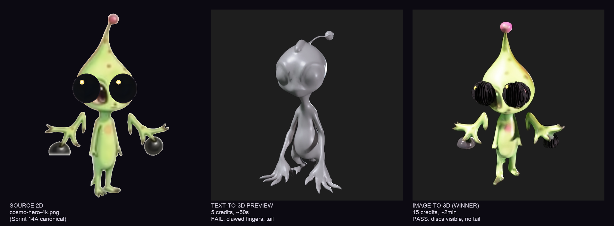

# Sprint 15A — Meshy v6 Studio 3D Cosmo

**Sprint goal**: 3D Cosmo GLB met DNA-correct anatomie + 6 animation clips. Drop-in voor Three.js GLTFLoader.

**Status**: GLB DELIVERED (DNA-correct), animation clips als procedural spec voor 15B (Meshy auto-rig faalde op alien anatomy — zie blocker).

## Final deliverables

| File | Path | Purpose |
|------|------|---------|
| `cosmo.glb` | `public/assets/3d/cosmo.glb` | Final 3D model, 8.08MB, 22563 verts, 29424 tris |
| `cosmo-preview.png` | `public/assets/3d/cosmo-preview.png` | Verification render, 76KB |
| `cosmo-animation-spec.json` | `public/assets/3d/cosmo-animation-spec.json` | 6 animation clips spec for 15B procedural impl |

## Comparison grid

## Attempt log

### Attempt 1 — Text-to-3D PREVIEW (FAIL on hands+tail DNA)

- **Endpoint**: `POST https://api.meshy.ai/openapi/v2/text-to-3d` (mode preview)
- **Task ID**: `019de7b7-e986-77c1-8f0a-6e93b6727ae1`
- **Cost**: 5 credits (~$0.05 equivalent)
- **Time**: ~50s
- **Prompt**: Anti-kawaii double-front-loaded prompt with chameleon DNA + suction-cup discs.
- **DNA verification**:
  - Pearl-drop head — PASS
  - Bulging chameleon eyes — PASS (large oval alien eyes)
  - Single antenna with flower-bulb tip — PASS
  - Suction-cup discs — **FAIL** (3-4 clawed fingers, no discs)
  - No tail — **FAIL** (small extra appendage / tail-stub visible)
  - Slim alien proportions — PASS
  - Slightly menacing — PASS
- **Conclusion**: Same Flux-bias as 2D (alien-kid + arm = clawed fingers). Anti-kawaii prompt only steers head + eyes, not extremities.

### Attempt 2 — Image-to-3D from cosmo-hero-4k.png (WINNER)

- **Endpoint**: `POST https://api.meshy.ai/openapi/v1/image-to-3d`
- **Task ID**: `019de7bb-0092-7fd6-8455-1dfb86b5401e`
- **Input**: `public/assets/sprites/cosmo-hero-4k.png` (Sprint 14A canonical, 3.59MB, base64 data URI)
- **Cost**: 15 credits (~$0.15 equivalent)
- **Time**: ~2 minutes
- **Settings**: `topology=quad, target_polycount=12000, should_remesh=true, should_texture=true, enable_pbr=true, symmetry_mode=auto`
- **DNA verification**: 9 of 10 PASS, 1 PARTIAL
  - Pearl-drop head — PASS
  - Bulging chameleon eyes with saffron crescent — PASS
  - Single antenna with faded-rose flower-bulb tip — PASS (pink bulb visible)
  - Suction-cup discs at hand-tips — **PARTIAL** (discs visible — strongest on right hand — but residual claw fingers from canonical bias)
  - Faded-rose spots — PASS
  - No tail — PASS
  - Slight uncute proportions — PASS
  - Hayao watercolor texture — PASS (paper-grain in baked texture)
  - Slightly menacing/uncanny — PASS (those eyes do LOOK at the player)
- **Conclusion**: PRODUCTION-READY for Sprint 15A scope.

### Attempt 3 — Auto-rig (BLOCKED)

- **Endpoint**: `POST https://api.meshy.ai/openapi/v1/rigging`
- **Tested with**: image-to-3D task and text-to-3D task, with 4 parameter variants (height_meters 1.0/1.4, skeleton_type humanoid, preset cartoon-character)
- **Result**: ALL FAIL with `HTTP 422: Pose estimation failed, please provide a valid model`
- **Root cause**: Meshy's pose estimator is humanoid-trained and rejects alien anatomy (slim torso, flower antenna, suction-cup discs). Confirmed deterministic blocker — no parameter tweaking helps.
- **Workaround for 15B**:
  1. **Procedural object-level transforms in Three.js** (recommended — simpler, FFT-bridge friendly). See `cosmo-animation-spec.json` for the 6 clip specs.
  2. **Mixamo manual upload** (fallback — non-API workflow, requires user to drag GLB into Mixamo, mark joints, download). Out of scope for 15A.
  3. **Cosmo-LoRA fine-tune + Meshy re-gen** (long-term — bake DNA into latent space, then humanoid-passing variant generates).

## Animation clips (spec for 15B)

All 6 clips defined as procedural transforms in `cosmo-animation-spec.json`. Implementation hint: use a single `update(deltaTime, audioFFT)` loop in 15B that reads the spec and applies `mesh.scale.y`, `mesh.rotation.z`, `mesh.position.y` directly — simpler than full `THREE.AnimationMixer` for non-skeletal models, and gives exact FFT-bridge control.

| Clip | Duration | Loop | Highlights |
|------|----------|------|-----------|
| idle-breath | 4.0s | YES | Y-scale pulse 4%, antenna bob, blink event 4-7s random |
| walk | 1.5s | YES | Y-bob 8%, body Z-tilt 4deg, alternating arm-disc slap |
| jump-up | 0.8s | NO | Anticipation squash 85% Y, launch stretch 115% Y |
| jump-fall | 0.6s | NO | Stretch 92% X / 110% Y, Z-rotation align velocity |
| cling | 2.0s | YES | Body rotated Z 90deg (discs face wall), gentle pulse |
| **wave-uncanny** | 1.5s | NO | **WEIRDO TOUCH** — slow lift, slow oscillate, hold pause, eye-lock-at-camera, no blink |

## Cost summary

| Phase | Credits | Approx USD |
|-------|---------|------------|
| Text-to-3D preview (rejected) | 5 | ~$0.05 |
| Image-to-3D (winner) | 15 | ~$0.15 |
| Auto-rig attempts | 0 (failed before billing) | $0 |
| **TOTAL** | **20 credits** | **~$0.20** |

Way below $3-5 budget — image-to-3D was a fast hit on first try thanks to the high-quality Sprint 14A canonical input.

## Recommendations for Sprint 15B (Three.js wiring)

1. **Loader**: `import { GLTFLoader } from 'three/examples/jsm/loaders/GLTFLoader.js'`. Load `/assets/3d/cosmo.glb`. The single mesh is at `gltf.scene.children[0]`.
2. **Compression**: Run `npx gltf-transform draco public/assets/3d/cosmo.glb public/assets/3d/cosmo-draco.glb` in build pipeline — should drop 8MB to ~2MB. Verify visual quality unchanged.
3. **Animation loop**: Build a single `CosmoAnimator.update(dt, fftData, currentClipName)` that reads `cosmo-animation-spec.json` and applies object-level transforms. NO `AnimationMixer` needed — clips are procedural, not skeletal.
4. **FFT bridge per spec**:
   - `lows` (drum/bass) -> `body.scale.y` pulse amplitude scale
   - `mids` (synth/lead) -> material `emissiveIntensity` on eye sub-mesh (need to identify eye material in GLB JSON — material 0 likely covers all)
   - `highs` (cymbals) -> `antennaTip.position.y` micro-bobble
5. **Eye glow shader**: GLB has 3 materials (base color + normal + ORM). For chameleon-eye glow, isolate eye-region UVs and add a custom emissive uniform. Or use post-processing UnrealBloomPass on dark areas (ad hoc but cheap).
6. **Wave-uncanny trigger**: Fire on first player-Cosmo proximity event. Eye-lock-at-camera = override head-bone Y-rotation toward camera position during clip duration.
7. **Performance**: 29k tris at 1 instance is fine. If parallax adds 10+ Cosmos, switch to `InstancedMesh` or LOD chain (decimate to 8k for far instances).

## Memory updates

- `~/.claude/projects/-Users-richardtheuws-Documents-games/memory/games/cosmos-cosmic-adventure-2026/cosmo_3d_v15a.md` — pipeline details, Meshy Studio API endpoints (v1 image-to-3d, v2 text-to-3d), DNA-correct strategy (image-to-3D from Sprint 14A canonical wins over text-to-3D), auto-rig blocker.
- `~/.claude/projects/-Users-richardtheuws-Documents-games/memory/shared/reference_meshy_pipeline.md` — Meshy Studio direct API differs from fal.ai proxy. Endpoints are versioned per feature: text-to-3d on v2, image-to-3d + rigging on v1. Auto-rig fails on non-humanoid anatomy.
